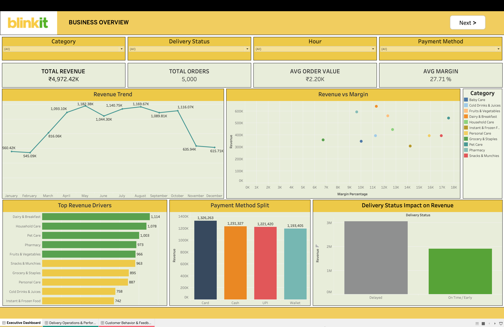
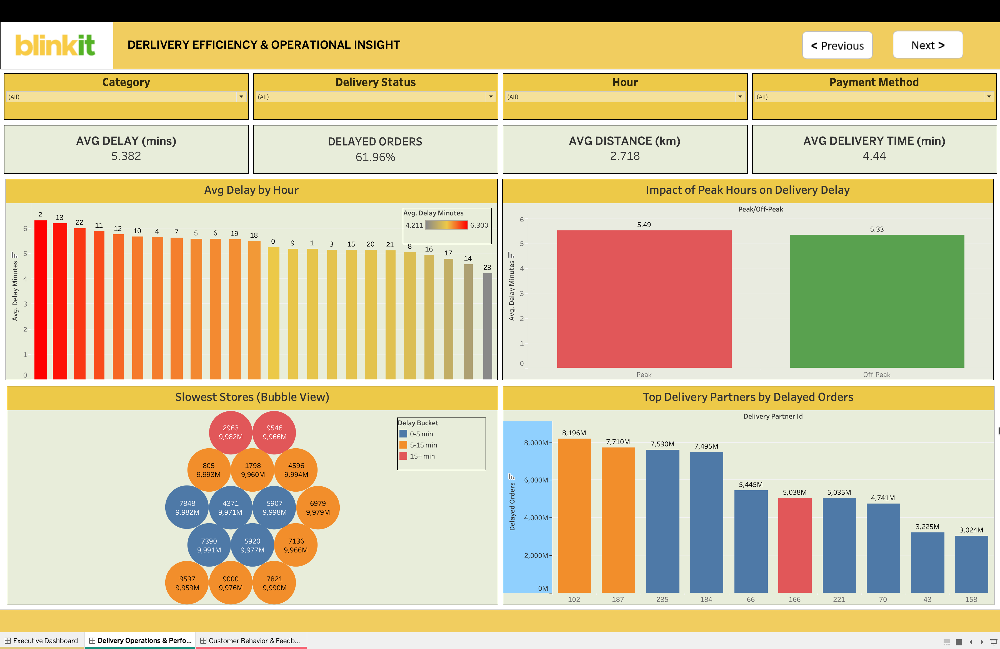
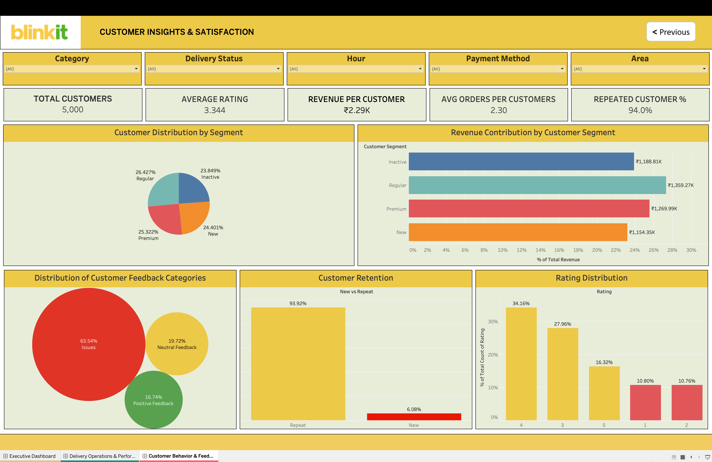

#  Blinkit Sales, Delivery & Customer Analytics Dashboard

This project presents a **complete end-to-end analytics solution** for Blinkit, covering **data engineering, analysis, and interactive dashboarding**.

It transforms raw operational data into **business insights** across:

* Revenue performance
* Delivery efficiency
* Customer behavior & satisfaction

---

#  Project Objective

The goal of this project is to answer key business questions:

*  How is revenue performing over time?
*  Where are delivery delays happening and why?
*  Which customers drive revenue?
*  What is causing poor customer satisfaction?
*  How can operations be optimized?

---

#  Project Workflow

Raw Data → ETL & Feature Engineering → Clean Dataset → EDA → Statistical Analysis → Tableau Dashboard

---
## 📊 Tableau Dashboard

### Dashboard Preview

 **Live Dashboard:**  
https://public.tableau.com/views/DVA-Capstone/ExecutiveDashboard?:language=en-GB&publish=yes&:sid=&:redirect=auth&:display_count=n&:origin=viz_share_link
#  Final Dashboard Overview

The dashboard is divided into **3 major sections**:

---

##  1. BUSINESS OVERVIEW

###  KPIs

* Total Revenue
* Total Orders
* Avg Order Value
* Avg Margin

 Provides a **quick snapshot of business health**

---

###  Revenue Trend (Line Chart)

**Why used:** Shows time-based trends

**Insight:**
Revenue peaks mid-year and drops towards year-end → indicates **seasonality or demand fluctuations**

---

###  Revenue vs Margin (Scatter Plot)

**Why used:** Shows relationship between profitability & sales

**Insight:**
Some categories have **high revenue but lower margins** → optimization opportunity

---

###  Top Revenue Drivers (Bar Chart)

**Insight:**
Categories like **Dairy & Breakfast and Household Care** contribute the most → should be prioritized

---

###  Payment Method Split

**Insight:**
Card & UPI dominate → strong **digital adoption**

---

###  Delivery Status Impact

**Insight:**
Delayed orders still generate revenue → but impact **customer experience**

---

##  2. DELIVERY EFFICIENCY & OPERATIONS

###  KPIs

* Avg Delay Time
* % Delayed Orders (~62%) 
* Avg Distance
* Avg Delivery Time

 Highlights **operational inefficiency**

---

###  Avg Delay by Hour

**Why used:** Identifies peak problem hours

**Insight:**
Delays are higher during peak hours → **capacity issue**

---

###  Peak vs Off-Peak Delay

**Insight:**
Peak hours have significantly more delay → confirms **operational overload**

---

###  Slowest Stores (Packed Bubble Chart)

**Why used:**
Shows **which stores contribute most to delays**

**Insight:**
Few stores dominate delays → **targeted improvement needed**

---

###  Top Delivery Partners by Delays

**Insight:**
Certain partners are responsible for high delays → **performance monitoring required**

---

##  3. CUSTOMER INSIGHTS & SATISFACTION

###  KPIs

* Total Customers
* Avg Rating (~3.3 ⭐) 
* Revenue per Customer
* Repeat Customer % (~94%)

 Shows **customer loyalty vs satisfaction gap**

---

###  Customer Segment Distribution (Donut Chart)

**Why used:** Shows proportion

**Insight:**
Customers are evenly distributed → no heavy dependency on one segment

---

###  Revenue by Customer Segment

**Insight:**
Regular & Premium customers drive most revenue → **high-value segments**

---

###  Feedback Distribution (Bubble Chart)

**Insight:**
~63% feedback is negative → major **service issues**

---

###  Customer Retention

**Insight:**
High repeat rate despite issues → customers stay, but risk of future churn

---

###  Rating Distribution

**Insight:**
Most ratings are average (3–4) → indicates **moderate satisfaction**

---

#  Key Business Findings

*  62% orders are delayed → major operational issue
*  Peak hours cause maximum delays
*  Few stores & partners drive most delays
*  63% customer feedback is negative
*  Ratings are average (~3.3)
*  Revenue is strong but customer experience is weak

---

#  Recommendations

* Optimize **peak-hour delivery capacity**
* Monitor and improve **underperforming stores**
* Track **delivery partner performance**
* Improve **customer experience to reduce negative feedback**
* Focus on **high-value customer segments**

---

#  How to Run

1. Run `02_cleaning.ipynb`
2. Run `03_eda.ipynb`
3. Run `04_statistical_analysis.ipynb`
4. Run `05_final_load_prep.ipynb`
5. Open Tableau dashboard

---

#  Key Learning

This project demonstrates:

* End-to-end data pipeline (ETL → Dashboard)
* Business problem solving using data
* Data visualization best practices
* Insight-driven decision making

---

#  Final Conclusion

While Blinkit shows **strong revenue performance**,
there are **serious delivery and customer experience issues**.

Improving delivery efficiency will directly lead to:
 Higher customer satisfaction
 Better ratings
 Long-term business growth

---
